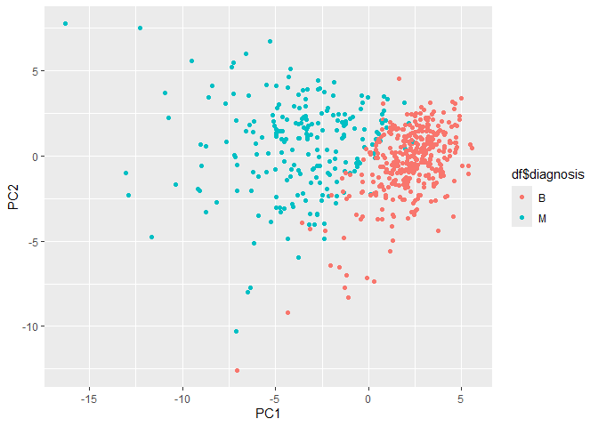
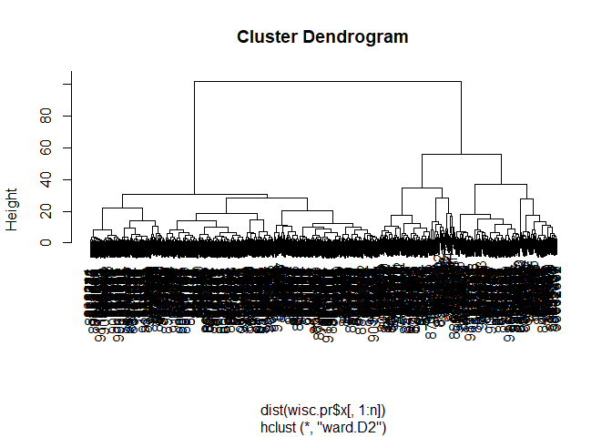
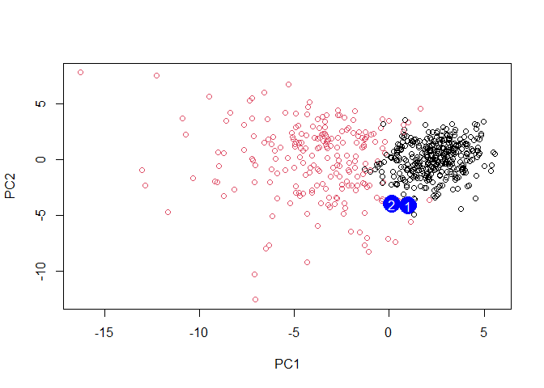

# Class 8 Mini-Project: Unsupervised Learning Analysis of Human Breast
Cancer Cells
Sabrina Wu (A16731683)

## Exploratory data analysis

### Importing Data

``` r
# Save your input data file into your Project directory
fna.data <- "WisconsinCancer.csv"

# Complete the following code to input the data and store as wisc.df
wisc.df <- read.csv(fna.data, row.names=1)
```

``` r
head(wisc.df)
```

             diagnosis radius_mean texture_mean perimeter_mean area_mean
    842302           M       17.99        10.38         122.80    1001.0
    842517           M       20.57        17.77         132.90    1326.0
    84300903         M       19.69        21.25         130.00    1203.0
    84348301         M       11.42        20.38          77.58     386.1
    84358402         M       20.29        14.34         135.10    1297.0
    843786           M       12.45        15.70          82.57     477.1
             smoothness_mean compactness_mean concavity_mean concave.points_mean
    842302           0.11840          0.27760         0.3001             0.14710
    842517           0.08474          0.07864         0.0869             0.07017
    84300903         0.10960          0.15990         0.1974             0.12790
    84348301         0.14250          0.28390         0.2414             0.10520
    84358402         0.10030          0.13280         0.1980             0.10430
    843786           0.12780          0.17000         0.1578             0.08089
             symmetry_mean fractal_dimension_mean radius_se texture_se perimeter_se
    842302          0.2419                0.07871    1.0950     0.9053        8.589
    842517          0.1812                0.05667    0.5435     0.7339        3.398
    84300903        0.2069                0.05999    0.7456     0.7869        4.585
    84348301        0.2597                0.09744    0.4956     1.1560        3.445
    84358402        0.1809                0.05883    0.7572     0.7813        5.438
    843786          0.2087                0.07613    0.3345     0.8902        2.217
             area_se smoothness_se compactness_se concavity_se concave.points_se
    842302    153.40      0.006399        0.04904      0.05373           0.01587
    842517     74.08      0.005225        0.01308      0.01860           0.01340
    84300903   94.03      0.006150        0.04006      0.03832           0.02058
    84348301   27.23      0.009110        0.07458      0.05661           0.01867
    84358402   94.44      0.011490        0.02461      0.05688           0.01885
    843786     27.19      0.007510        0.03345      0.03672           0.01137
             symmetry_se fractal_dimension_se radius_worst texture_worst
    842302       0.03003             0.006193        25.38         17.33
    842517       0.01389             0.003532        24.99         23.41
    84300903     0.02250             0.004571        23.57         25.53
    84348301     0.05963             0.009208        14.91         26.50
    84358402     0.01756             0.005115        22.54         16.67
    843786       0.02165             0.005082        15.47         23.75
             perimeter_worst area_worst smoothness_worst compactness_worst
    842302            184.60     2019.0           0.1622            0.6656
    842517            158.80     1956.0           0.1238            0.1866
    84300903          152.50     1709.0           0.1444            0.4245
    84348301           98.87      567.7           0.2098            0.8663
    84358402          152.20     1575.0           0.1374            0.2050
    843786            103.40      741.6           0.1791            0.5249
             concavity_worst concave.points_worst symmetry_worst
    842302            0.7119               0.2654         0.4601
    842517            0.2416               0.1860         0.2750
    84300903          0.4504               0.2430         0.3613
    84348301          0.6869               0.2575         0.6638
    84358402          0.4000               0.1625         0.2364
    843786            0.5355               0.1741         0.3985
             fractal_dimension_worst
    842302                   0.11890
    842517                   0.08902
    84300903                 0.08758
    84348301                 0.17300
    84358402                 0.07678
    843786                   0.12440

Removing the first column/diagnosis column and saving in new dataset

``` r
wisc.data <- wisc.df[,-1]
```

Saving the diagnosis column as a vector. `factor()` converts vector of
values into a variable by assigning levels.

``` r
# Create diagnosis vector for later 
diagnosis <- factor(wisc.df$diagnosis)
```

> Q1. How many observations are in this dataset?

``` r
nrow(wisc.data)
```

    [1] 569

There are 569 observations in this dataset.

> Q2. How many of the observations have a malignant diagnosis?

``` r
sum(diagnosis == "M")
```

    [1] 212

212 of the observations have a malignant diagnosis.

> Q3. How many variables/features in the data are suffixed with \_mean?

`grep()` search for matches to a pattern

``` r
length(grep("_mean",names(wisc.data)))
```

    [1] 10

There are 10 variables with the suffix “\_mean”.

## Principal Component Analysis (PCA)

### Performing PCA

Check standard deviation to see if need to be scaled

``` r
# Check column means and standard deviations
colMeans(wisc.data)
```

                radius_mean            texture_mean          perimeter_mean 
               1.412729e+01            1.928965e+01            9.196903e+01 
                  area_mean         smoothness_mean        compactness_mean 
               6.548891e+02            9.636028e-02            1.043410e-01 
             concavity_mean     concave.points_mean           symmetry_mean 
               8.879932e-02            4.891915e-02            1.811619e-01 
     fractal_dimension_mean               radius_se              texture_se 
               6.279761e-02            4.051721e-01            1.216853e+00 
               perimeter_se                 area_se           smoothness_se 
               2.866059e+00            4.033708e+01            7.040979e-03 
             compactness_se            concavity_se       concave.points_se 
               2.547814e-02            3.189372e-02            1.179614e-02 
                symmetry_se    fractal_dimension_se            radius_worst 
               2.054230e-02            3.794904e-03            1.626919e+01 
              texture_worst         perimeter_worst              area_worst 
               2.567722e+01            1.072612e+02            8.805831e+02 
           smoothness_worst       compactness_worst         concavity_worst 
               1.323686e-01            2.542650e-01            2.721885e-01 
       concave.points_worst          symmetry_worst fractal_dimension_worst 
               1.146062e-01            2.900756e-01            8.394582e-02 

``` r
apply(wisc.data,2,sd)
```

                radius_mean            texture_mean          perimeter_mean 
               3.524049e+00            4.301036e+00            2.429898e+01 
                  area_mean         smoothness_mean        compactness_mean 
               3.519141e+02            1.406413e-02            5.281276e-02 
             concavity_mean     concave.points_mean           symmetry_mean 
               7.971981e-02            3.880284e-02            2.741428e-02 
     fractal_dimension_mean               radius_se              texture_se 
               7.060363e-03            2.773127e-01            5.516484e-01 
               perimeter_se                 area_se           smoothness_se 
               2.021855e+00            4.549101e+01            3.002518e-03 
             compactness_se            concavity_se       concave.points_se 
               1.790818e-02            3.018606e-02            6.170285e-03 
                symmetry_se    fractal_dimension_se            radius_worst 
               8.266372e-03            2.646071e-03            4.833242e+00 
              texture_worst         perimeter_worst              area_worst 
               6.146258e+00            3.360254e+01            5.693570e+02 
           smoothness_worst       compactness_worst         concavity_worst 
               2.283243e-02            1.573365e-01            2.086243e-01 
       concave.points_worst          symmetry_worst fractal_dimension_worst 
               6.573234e-02            6.186747e-02            1.806127e-02 

Data should be scale since the mean and standard deviation varies a lot
among the different variables from a few hundreds to hundredths.

Performing PCA on scaled data.

``` r
#Rescaling wisc.data 
wisc.data.scaled <- scale(wisc.data)
```

``` r
# Perform PCA 
wisc.pr <- prcomp(wisc.data.scaled)
```

``` r
#Look at summary of results
summary(wisc.pr)
```

    Importance of components:
                              PC1    PC2     PC3     PC4     PC5     PC6     PC7
    Standard deviation     3.6444 2.3857 1.67867 1.40735 1.28403 1.09880 0.82172
    Proportion of Variance 0.4427 0.1897 0.09393 0.06602 0.05496 0.04025 0.02251
    Cumulative Proportion  0.4427 0.6324 0.72636 0.79239 0.84734 0.88759 0.91010
                               PC8    PC9    PC10   PC11    PC12    PC13    PC14
    Standard deviation     0.69037 0.6457 0.59219 0.5421 0.51104 0.49128 0.39624
    Proportion of Variance 0.01589 0.0139 0.01169 0.0098 0.00871 0.00805 0.00523
    Cumulative Proportion  0.92598 0.9399 0.95157 0.9614 0.97007 0.97812 0.98335
                              PC15    PC16    PC17    PC18    PC19    PC20   PC21
    Standard deviation     0.30681 0.28260 0.24372 0.22939 0.22244 0.17652 0.1731
    Proportion of Variance 0.00314 0.00266 0.00198 0.00175 0.00165 0.00104 0.0010
    Cumulative Proportion  0.98649 0.98915 0.99113 0.99288 0.99453 0.99557 0.9966
                              PC22    PC23   PC24    PC25    PC26    PC27    PC28
    Standard deviation     0.16565 0.15602 0.1344 0.12442 0.09043 0.08307 0.03987
    Proportion of Variance 0.00091 0.00081 0.0006 0.00052 0.00027 0.00023 0.00005
    Cumulative Proportion  0.99749 0.99830 0.9989 0.99942 0.99969 0.99992 0.99997
                              PC29    PC30
    Standard deviation     0.02736 0.01153
    Proportion of Variance 0.00002 0.00000
    Cumulative Proportion  1.00000 1.00000

> Q4. From your results, what proportion of the original variance is
> captured by the first principal components (PC1)?

44.27% of the original variance is captured by PC1.

> Q5. How many principal components (PCs) are required to describe at
> least 70% of the original variance in the data?

``` r
cumsum(summary(wisc.pr)$importance[2,])>=0.7
```

      PC1   PC2   PC3   PC4   PC5   PC6   PC7   PC8   PC9  PC10  PC11  PC12  PC13 
    FALSE FALSE  TRUE  TRUE  TRUE  TRUE  TRUE  TRUE  TRUE  TRUE  TRUE  TRUE  TRUE 
     PC14  PC15  PC16  PC17  PC18  PC19  PC20  PC21  PC22  PC23  PC24  PC25  PC26 
     TRUE  TRUE  TRUE  TRUE  TRUE  TRUE  TRUE  TRUE  TRUE  TRUE  TRUE  TRUE  TRUE 
     PC27  PC28  PC29  PC30 
     TRUE  TRUE  TRUE  TRUE 

Three PCs are needed to describe at least 70% of the original variance
in the data.

> Q6. How many principal components (PCs) are required to describe at
> least 90% of the original variance in the data?

``` r
cumsum(summary(wisc.pr)$importance[2,])>=0.9
```

      PC1   PC2   PC3   PC4   PC5   PC6   PC7   PC8   PC9  PC10  PC11  PC12  PC13 
    FALSE FALSE FALSE FALSE FALSE FALSE  TRUE  TRUE  TRUE  TRUE  TRUE  TRUE  TRUE 
     PC14  PC15  PC16  PC17  PC18  PC19  PC20  PC21  PC22  PC23  PC24  PC25  PC26 
     TRUE  TRUE  TRUE  TRUE  TRUE  TRUE  TRUE  TRUE  TRUE  TRUE  TRUE  TRUE  TRUE 
     PC27  PC28  PC29  PC30 
     TRUE  TRUE  TRUE  TRUE 

Seven PCs are needed to describe at least 90% of the original variance
in the data.

### Interpreting PCA Results

Creating biplot

``` r
biplot(wisc.pr)
```


> Q7. What stands out to you about this plot? Is it easy or difficult to
> understand? Why?

What stands out the most is that all the variables/pink vectors seems to
be all pointing left/into the negative of PC1. This plot is difficult to
understand as all the names are overlapping each other.

Changing to scatterplots

``` r
# Scatter plot observations by components 1 and 2
plot(wisc.pr$x[,1], wisc.pr$x[,2], col=diagnosis, xlab = "PC1", ylab = "PC2")
```


> Q8. Generate a similar plot for principal components 1 and 3. What do
> you notice about these plots?

``` r
# Repeat for components 1 and 3
plot(wisc.pr$x[,1],wisc.pr$x[,3], col = diagnosis, xlab = "PC1", ylab = "PC3")
```


Both graphs seem to show that the red dots signifying malignant ones are
more left than the benign ones on the axis of PC1.

ggplot

``` r
# Create a data.frame for ggplot
df <- as.data.frame(wisc.pr$x)
df$diagnosis <- diagnosis

# Load the ggplot2 package
library(ggplot2)

# Make a scatter plot colored by diagnosis
ggplot(df) + 
  aes(PC1, PC2, col=df$diagnosis) + 
  geom_point()
```

    Warning: Use of `df$diagnosis` is discouraged.
    ℹ Use `diagnosis` instead.



### Variance Explained

``` r
# Calculate variance of each component by squaring standard deviation
pr.var <- wisc.pr$sdev^2
head(pr.var)
```

    [1] 13.281608  5.691355  2.817949  1.980640  1.648731  1.207357

Calculating the variance explained by each principal component over
total

``` r
# Variance explained by each principal component: pve
pve <- pr.var / sum(pr.var)

# Plot variance explained for each principal component
plot(pve, xlab = "Principal Component", 
     ylab = "Proportion of Variance Explained", 
     ylim = c(0, 1), type = "o")
```


Can also make a scree plot + other plots

``` r
# Alternative scree plot of the same data, note data driven y-axis
barplot(pve, ylab = "Precent of Variance Explained",
     names.arg=paste0("PC",1:length(pve)), las=2, axes = FALSE)
axis(2, at=pve, labels=round(pve,2)*100 )
```


``` r
## ggplot based graph
#install.packages("factoextra")
library(factoextra)
```

    Welcome! Want to learn more? See two factoextra-related books at https://goo.gl/ve3WBa

``` r
fviz_eig(wisc.pr, addlabels = TRUE)
```


### Communicating PCA results

> Q9. For the first principal component, what is the component of the
> loading vector (i.e. wisc.pr\$rotation\[,1\]) for the feature
> concave.points_mean?

``` r
wisc.pr$rotation["concave.points_mean", 1]
```

    [1] -0.2608538

wisc.pr\$rotaion\[,1\] represents how strongly this influences PC1.
Since the loading is -0.26, it means that it has a negative contribution
to PC1. In context of breast cancer, it signifies that cells with more
concave points will have lower PC1 scores.

> Q10. What is the minimum number of principal components required to
> explain 80% of the variance of the data?

``` r
cumsum(pve) >= 0.8
```

     [1] FALSE FALSE FALSE FALSE  TRUE  TRUE  TRUE  TRUE  TRUE  TRUE  TRUE  TRUE
    [13]  TRUE  TRUE  TRUE  TRUE  TRUE  TRUE  TRUE  TRUE  TRUE  TRUE  TRUE  TRUE
    [25]  TRUE  TRUE  TRUE  TRUE  TRUE  TRUE

Five principal components are required to explain 80% of the variance of
the data.

## Hierarchical clustering

``` r
# Scale the wisc.data data using the "scale()" function
data.scaled <- scale(wisc.data)
```

`data.scale`is the same as `wisc.df.scale` done earlier

Calculate the (Euclidean) distances between all pairs of observations in
the new scaled dataset

``` r
data.dist <- dist(data.scaled)
```

Create a hierarchical clustering model

``` r
wisc.hclust <- hclust(data.dist, method="complete")
```

## Results of hierarchical clustering

> Q11. Using the plot() and abline() functions, what is the height at
> which the clustering model has 4 clusters?

``` r
plot(wisc.hclust)
abline(h=19, col="red", lty=2)
```


The height with four cluster is between 15 and 20.

## Selecting number of clusters

Cutting the tree so there are only 4 clusters

``` r
wisc.hclust.clusters <- cutree(wisc.hclust,k=4)
```

Use table to compare the cluster to actual diagnosis

``` r
table(wisc.hclust.clusters, diagnosis)
```

                        diagnosis
    wisc.hclust.clusters   B   M
                       1  12 165
                       2   2   5
                       3 343  40
                       4   0   2

> Q12. Can you find a better cluster vs diagnoses match by cutting into
> a different number of clusters between 2 and 10?

``` r
table(cutree(wisc.hclust,k=4), diagnosis)
```

       diagnosis
          B   M
      1  12 165
      2   2   5
      3 343  40
      4   0   2

From clusters 2 and 10, 4 is the best with the most amount of separation
between benign and malignant ane little fragmentation.

> Q13. Which method gives your favorite results for the same data.dist
> dataset? Explain your reasoning.

``` r
wisc.single <- hclust(data.dist, method="single")
wisc.complete <- hclust(data.dist, method="complete")
wisc.average <- hclust(data.dist, method="average")
wisc.ward <- hclust(data.dist, method="ward.D2")

single.clusters <- cutree(wisc.single,k=4)
table(single.clusters, diagnosis)
```

                   diagnosis
    single.clusters   B   M
                  1 356 209
                  2   1   0
                  3   0   2
                  4   0   1

``` r
complete.clusters <- cutree(wisc.complete,k=4)
table(complete.clusters, diagnosis)
```

                     diagnosis
    complete.clusters   B   M
                    1  12 165
                    2   2   5
                    3 343  40
                    4   0   2

``` r
average.clusters <- cutree(wisc.average,k=4)
table(average.clusters, diagnosis)
```

                    diagnosis
    average.clusters   B   M
                   1 355 209
                   2   2   0
                   3   0   1
                   4   0   2

``` r
ward.clusters <- cutree(wisc.ward,k=4)
table(ward.clusters, diagnosis)
```

                 diagnosis
    ward.clusters   B   M
                1   0 115
                2   6  48
                3 337  48
                4  14   1

The `ward.D2` method worked the best. It created the clearest separation
between malignant and benign cells as cluster 1 had all malignant and
cluster 3 is mostly benign. The `single` and `average` created one big
mixed cluster and `complete` had more mixing than the `ward`.

## Optional: K-menas clustering

Using kmeans

``` r
wisc.km <- kmeans(wisc.data.scaled, centers=2, nstart=20)
```

Comparing kmeans to actual diagnoses

``` r
table(wisc.km$cluster, diagnosis)
```

       diagnosis
          B   M
      1  14 175
      2 343  37

> Q14. How well does k-means separate the two diagnoses? How does it
> compare to your hclust results?

It was able to separate the two diagnoses fairly well using the k-mean.
It is slightly better than the hclust with four clusters but a lot
better if only using two clusters in hclust. There are a little less
mixing within each cluster.

``` r
table(wisc.hclust.clusters, wisc.km$cluster)
```

                        
    wisc.hclust.clusters   1   2
                       1 160  17
                       2   7   0
                       3  20 363
                       4   2   0

Clusters 1,2,4 from hierarchical are equivalents to cluster 2 from
kmeans, and cluster 3 is equivalent to kmeans cluster 1.

\##Combining methods

### Clustering on PCA results

``` r
n <- which(cumsum(pve) >= 0.9)
wisc.pr.hclust <- hclust(dist(wisc.pr$x[,1:n]), method="ward.D2")
```

    Warning in 1:n: numerical expression has 24 elements: only the first used

``` r
plot(wisc.pr.hclust)
```



Two distinct clusters seen.

``` r
grps <- cutree(wisc.pr.hclust, k=2)
table(grps)
```

    grps
      1   2 
    216 353 

``` r
table(grps, diagnosis)
```

        diagnosis
    grps   B   M
       1  28 188
       2 329  24

``` r
plot(wisc.pr$x[,1:2], col=grps)
```


``` r
plot(wisc.pr$x[,1:2], col=diagnosis)
```


Switching color so it match each other by releveling

``` r
g <- as.factor(grps)
levels(g)
```

    [1] "1" "2"

``` r
g <- relevel(g,2)
levels(g)
```

    [1] "2" "1"

``` r
# Plot using our re-ordered factor 
plot(wisc.pr$x[,1:2], col=g)
```


Note: can make 3D plots using `rgl` and `ploty` packages (not included
here for pdf submission)

``` r
#library(rgl)
#plot3d(wisc.pr$x[,1:3], xlab="PC 1", ylab="PC 2", zlab="PC 3", cex=1.5, size=1, type="s", col=grps)
```

``` r
## Use the distance along the first 7 PCs for clustering i.e. wisc.pr$x[, 1:7]
wisc.pr.hclust <- hclust(dist(wisc.pr$x[,1:7]), method="ward.D2")
```

Model into 2 clusters

``` r
wisc.pr.hclust.clusters <- cutree(wisc.pr.hclust, k=2)
```

> Q15. How well does the newly created model with four clusters separate
> out the two diagnoses?

``` r
# Compare to actual diagnoses
table(wisc.pr.hclust.clusters, diagnosis)
```

                           diagnosis
    wisc.pr.hclust.clusters   B   M
                          1  28 188
                          2 329  24

This is even better than before. It is cleaner with less mixing.

> Q16. How well do the k-means and hierarchical clustering models you
> created in previous sections (i.e. before PCA) do in terms of
> separating the diagnoses? Again, use the table() function to compare
> the output of each model (wisc.km\$cluster and wisc.hclust.clusters)
> with the vector containing the actual diagnoses.

``` r
table(wisc.km$cluster, diagnosis)
```

       diagnosis
          B   M
      1  14 175
      2 343  37

``` r
table(wisc.hclust.clusters, diagnosis)
```

                        diagnosis
    wisc.hclust.clusters   B   M
                       1  12 165
                       2   2   5
                       3 343  40
                       4   0   2

These two methods separate them fairly decently as there are clear
clusters of where there are majority of one diagnosis over the other.

## Sensitivity/Specificity

> Q17. Which of your analysis procedures resulted in a clustering model
> with the best specificity? How about sensitivity?

``` r
table(wisc.pr.hclust.clusters, diagnosis)
```

                           diagnosis
    wisc.pr.hclust.clusters   B   M
                          1  28 188
                          2 329  24

``` r
table(wisc.km$cluster, diagnosis)
```

       diagnosis
          B   M
      1  14 175
      2 343  37

``` r
table(wisc.hclust.clusters, diagnosis)
```

                        diagnosis
    wisc.hclust.clusters   B   M
                       1  12 165
                       2   2   5
                       3 343  40
                       4   0   2

For `ward` hcluster: Sensitivity = 188/(188+24) = 0.887 Specificity =
329/(329+28) = 0.922

For kmeans: Sensitivity = 175/(175+37) = 0.825 Specificity =
343/(343+14) = 0.961

For `complete` hcluster: Sensitivity = 165/(165+40+5+2) = 0.778
Specificity = 343/(343+12+2) = 0.961

For specificity, kmeans and the `complete` hcluster performs the best,
while for sensitivity, `ward` hcluster is the best.

## Prediction

``` r
#url <- "new_samples.csv"
url <- "C:/Users/sabri/Downloads/new_samples.csv"
new <- read.csv(url)
npc <- predict(wisc.pr, newdata=new)
npc
```

               PC1        PC2        PC3       PC4      PC5       PC6        PC7
    [1,] -10.76452 -10.093978 -0.5897994 -4.164748 10.61922 -1.630738 0.03566861
    [2,] -18.09606  -9.967098 -2.1549431 -4.006848  6.69687 -2.034714 1.25088149
               PC8       PC9     PC10       PC11     PC12       PC13      PC14
    [1,] 0.7308658 -1.580861 3.166451 -0.7167150 3.850569 -0.8259764 1.0195729
    [2,] 0.6308585 -1.155629 3.608207 -0.3405375 2.288732 -0.3976672 0.1347203
             PC15      PC16      PC17      PC18     PC19      PC20      PC21
    [1,] 3.735687 -4.068783 1.0877034 0.9985959 1.022760 -2.430215 -1.295749
    [2,] 3.543905 -3.749616 0.7613603 1.1763217 1.366702 -2.609643 -1.541050
              PC22       PC23      PC24       PC25      PC26      PC27       PC28
    [1,] -1.348026 -0.7388274 -1.083000 -0.4220831 -1.892993 -1.176056 0.05527974
    [2,] -1.424290 -0.7591376 -1.439202 -0.6508838 -1.981711 -1.397390 0.18112357
              PC29       PC30
    [1,] 0.2658028 0.05162840
    [2,] 0.2842191 0.02734355

``` r
plot(wisc.pr$x[,1:2], col=g)
points(npc[,14], npc[,4], col="blue", pch=16, cex=3)
text(npc[,14], npc[,4], c(1,2), col="white")
```



> Q18. Which of these new patients should we prioritize for follow up
> based on your results?

Patient 2 should be prioritize as it is more likely that he/she has a
malignant one based on the prediction.
