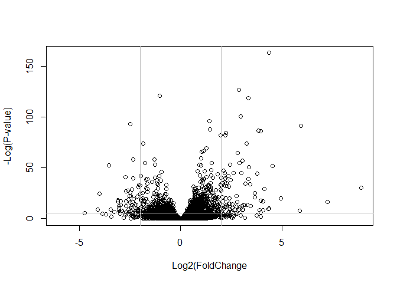

# Class13: RNASeq with DESeq 2
Sabrina Wu (A16731683)

Today we will analyze some RNASeq data from Himes et al. on th eeffects
of dexamethosone (dex), a synthetic glucocorticoid steroid on airway
smooth muscle cells (ASM).

\#Data Import

``` r
# Complete the missing code
counts <- read.csv("airway_scaledcounts.csv", row.names=1)
metadata <-  read.csv("airway_metadata.csv")
```

``` r
head(counts)
```

                    SRR1039508 SRR1039509 SRR1039512 SRR1039513 SRR1039516
    ENSG00000000003        723        486        904        445       1170
    ENSG00000000005          0          0          0          0          0
    ENSG00000000419        467        523        616        371        582
    ENSG00000000457        347        258        364        237        318
    ENSG00000000460         96         81         73         66        118
    ENSG00000000938          0          0          1          0          2
                    SRR1039517 SRR1039520 SRR1039521
    ENSG00000000003       1097        806        604
    ENSG00000000005          0          0          0
    ENSG00000000419        781        417        509
    ENSG00000000457        447        330        324
    ENSG00000000460         94        102         74
    ENSG00000000938          0          0          0

``` r
head(metadata)
```

              id     dex celltype     geo_id
    1 SRR1039508 control   N61311 GSM1275862
    2 SRR1039509 treated   N61311 GSM1275863
    3 SRR1039512 control  N052611 GSM1275866
    4 SRR1039513 treated  N052611 GSM1275867
    5 SRR1039516 control  N080611 GSM1275870
    6 SRR1039517 treated  N080611 GSM1275871

> Q1. How many genes are in this dataset?

``` r
nrow(counts)
```

    [1] 38694

THere are 38694 genes.

> Q2. How many ‘control’ cell lines do we have?

``` r
sum(metadata$dex == "control")
```

    [1] 4

``` r
table(metadata$dex)
```


    control treated 
          4       4 

There are 4 control cell lines.

## Toy differential gene expression

Calculate the mean per gene count values for all “control” samples (i.e
columns in `counts`) and do the same for “treated” and then compare
them.

1.  Find all “control” values/columns in `counts`

``` r
control.inds <- metadata$dex=="control"
control.counts <- counts[,control.inds]
```

2.  Find the mean per gene across all control columns

``` r
control.mean <- apply(control.counts, 1, mean)
```

> Q3. How would you make the above code in either approach more robust?
> Is there a function that could help here?

Use apply function.

> Q4. Follow the same procedure for the treated samples (i.e. calculate
> the mean per gene across drug treated samples and assign to a labeled
> vector called treated.mean)

3.  Do the same steps to find the `treated.mean`

``` r
treated.mean<- apply(counts[,metadata$dex=="treated"],1, mean)
```

4.  Plot control vs treated

``` r
meancounts <- data.frame(control.mean, treated.mean)
colSums(meancounts)
```

    control.mean treated.mean 
        23005324     22196524 

> Q5 (a). Create a scatter plot showing the mean of the treated samples
> against the mean of the control samples. Your plot should look
> something like the following.

``` r
plot(meancounts, xlab="Control", ylab="Treated")
```


Data is heavily skewed. Lots of value near the bottom. Need to transform
to log.

> Q5 (b).You could also use the ggplot2 package to make this figure
> producing the plot below. What geom\_?() function would you use for
> this plot?

``` r
library(ggplot2)

ggplot(meancounts)+aes(x=control.mean, y=treated.mean)+
  geom_point(alpha=0.3)
```


> Q6. Try plotting both axes on a log scale. What is the argument to
> plot() that allows you to do this?

``` r
plot(meancounts, log="xy")
```

    Warning in xy.coords(x, y, xlabel, ylabel, log): 15032 x values <= 0 omitted
    from logarithmic plot

    Warning in xy.coords(x, y, xlabel, ylabel, log): 15281 y values <= 0 omitted
    from logarithmic plot


We most frequently use log2 transformations for this type of data.
Because it shows you the fold change between the two. See difference
from the 45 degrees line.

``` r
log2(10/10)
```

    [1] 0

``` r
log2(20/10)
```

    [1] 1

``` r
log2(10/20)
```

    [1] -1

2^1 is the fold change. These log2 values make the interpretation of
“fold-change” a little easier and a rule-of-thumb in the filed is a log2
fold-change of +2 or -2 is where we start to pay attention.

Let calculate the log2(fold-change) and add it to our `meancounts`

``` r
meancounts$log2fc <- log2(meancounts$treated.mean/meancounts$control.mean)
head(meancounts)
```

                    control.mean treated.mean      log2fc
    ENSG00000000003       900.75       658.00 -0.45303916
    ENSG00000000005         0.00         0.00         NaN
    ENSG00000000419       520.50       546.00  0.06900279
    ENSG00000000457       339.75       316.50 -0.10226805
    ENSG00000000460        97.25        78.75 -0.30441833
    ENSG00000000938         0.75         0.00        -Inf

Want to get rid of the “Weird” results

``` r
to.rm <- rowSums(meancounts[,1:2]==0) >0
mycounts <- meancounts[!to.rm,]
```

> Q. How many genes do I have left after this zero count filtering?

``` r
nrow(mycounts)
```

    [1] 21817

or can do this way

``` r
#zero.vals <- which(meancounts[,1:2]==0, arr.ind=TRUE)

#to.rm <- unique(zero.vals[,1])
#mycounts <- meancounts[-to.rm,]
#head(mycounts)
```

> Q7. What is the purpose of the arr.ind argument in the which()
> function call above? Why would we then take the first column of the
> output and need to call the unique() function?

It will give the both the row and columns where there is 0 count.

> Q8. Using the up.ind vector above can you determine how many up
> regulated genes we have at the greater than 2 fc level?

1.  I need to extract the log2fc values
2.  I need to find those that are above +2
3.  Coutn them

``` r
sum(mycounts$log2fc >2)
```

    [1] 250

There are 250 genes that are “up”regulated upon drug treatment at
threshold of +2 log2fold.

> Q9. Using the down.ind vector above can you determine how many down
> regulated genes we have at the greater than 2 fc level?

``` r
sum(mycounts$log2fc < -2)
```

    [1] 367

There are 367 genes that are “down” regulated upon drug treatment at
threshold of +2 log2fold.

> Q10. Do you trust these results? Why or why not?

No, we haven’t tested to see if the change are statistically
significantly.’

Let’s do this analysis the right way with stats and use the **DESeq2**
package

## Setting up for DESeq + DESeq analysis

``` r
library(DESeq2)
```

    Warning: package 'matrixStats' was built under R version 4.4.2

The first function that we will use will setup the data in the way
(format) DESeq wants it

``` r
dds <- DESeqDataSetFromMatrix(countData=counts, 
                              colData=metadata, 
                              design=~dex) #comparing the dex column (control vs treated)
```

    converting counts to integer mode

    Warning in DESeqDataSet(se, design = design, ignoreRank): some variables in
    design formula are characters, converting to factors

``` r
dds
```

    class: DESeqDataSet 
    dim: 38694 8 
    metadata(1): version
    assays(1): counts
    rownames(38694): ENSG00000000003 ENSG00000000005 ... ENSG00000283120
      ENSG00000283123
    rowData names(0):
    colnames(8): SRR1039508 SRR1039509 ... SRR1039520 SRR1039521
    colData names(4): id dex celltype geo_id

The function in the package is called `Deseq()` and we can run it on our
`dds` object

``` r
dds <- DESeq(dds)
```

    estimating size factors

    estimating dispersions

    gene-wise dispersion estimates

    mean-dispersion relationship

    final dispersion estimates

    fitting model and testing

I will get the results from dds with the `results()` function:

``` r
res <- results(dds)
head(res)
```

    log2 fold change (MLE): dex treated vs control 
    Wald test p-value: dex treated vs control 
    DataFrame with 6 rows and 6 columns
                      baseMean log2FoldChange     lfcSE      stat    pvalue
                     <numeric>      <numeric> <numeric> <numeric> <numeric>
    ENSG00000000003 747.194195     -0.3507030  0.168246 -2.084470 0.0371175
    ENSG00000000005   0.000000             NA        NA        NA        NA
    ENSG00000000419 520.134160      0.2061078  0.101059  2.039475 0.0414026
    ENSG00000000457 322.664844      0.0245269  0.145145  0.168982 0.8658106
    ENSG00000000460  87.682625     -0.1471420  0.257007 -0.572521 0.5669691
    ENSG00000000938   0.319167     -1.7322890  3.493601 -0.495846 0.6200029
                         padj
                    <numeric>
    ENSG00000000003  0.163035
    ENSG00000000005        NA
    ENSG00000000419  0.176032
    ENSG00000000457  0.961694
    ENSG00000000460  0.815849
    ENSG00000000938        NA

## Data Visualization

### Volcano Plot

Make a common overall results figure from this analysis. This plot is
designed to keep our inner biologist and inner stats nerd happy. Plot of
fold-change in x vs P-value in y-axis

``` r
plot(res$log2FoldChange, -log(res$padj),
     xlab="Log2(FoldChange",
     ylab="-Log(P-value)") #more strict p-value

# Add some cut-off lines
abline(v=c(-2,2), col="gray") #vertical lines of threshold of 2 foldchange
abline(h=-log(0.005), col="gray") #horizontal lines of threshold of p value of 0.005
```



Add some color to this plot

``` r
mycols <- rep("gray",nrow(res))
mycols[res$log2FoldChange>2] <- "red"
mycols[res$log2FoldChange< -2] <- "red"

inds <- (res$padj < 0.01) & (abs(res$log2FoldChange) > 2 )
mycols[ inds ] <- "blue"

plot(res$log2FoldChange, -log(res$padj), col=mycols, xlab="Log2(FoldChange",
     ylab="-Log(P-value)")
abline(v=c(-2,2), col="gray")
abline(h=-log(0.005), col="gray")
```


save my results to date out to disc

``` r
write.csv(res,file="myresults.csv")
```

We will pick this up net day and add **annotation** (i.e what are these
genes of interest) and do **pathway analysis** (what biology) are they
known to be involved with.

I need to translate the identifiers “ENSG0000..” into gene names that
the rest of the world can understand

To this “annotation” I will ues the **“AnnotationDbi”** package. I can
install this with `BiocManger:: install()`

``` r
library(AnnotationDbi)
library(org.Hs.eg.db) #for human database
```

``` r
columns(org.Hs.eg.db)
```

     [1] "ACCNUM"       "ALIAS"        "ENSEMBL"      "ENSEMBLPROT"  "ENSEMBLTRANS"
     [6] "ENTREZID"     "ENZYME"       "EVIDENCE"     "EVIDENCEALL"  "GENENAME"    
    [11] "GENETYPE"     "GO"           "GOALL"        "IPI"          "MAP"         
    [16] "OMIM"         "ONTOLOGY"     "ONTOLOGYALL"  "PATH"         "PFAM"        
    [21] "PMID"         "PROSITE"      "REFSEQ"       "SYMBOL"       "UCSCKG"      
    [26] "UNIPROT"     

I will use the `mapIds()` function to ” map” my identifier to those from
different databases. I will go between “ENSEMBL” and “SYMBOL” (and then
after “GENENAME”)

``` r
res$symbol <- mapIds(org.Hs.eg.db,
                     keys=rownames(res),
                     keytype = "ENSEMBL",
                     column = "SYMBOL")
```

    'select()' returned 1:many mapping between keys and columns

Add “GENENAME”

``` r
res$genename <- mapIds(org.Hs.eg.db,
                     keys=rownames(res),
                     keytype = "ENSEMBL",
                     column = "GENENAME")
```

    'select()' returned 1:many mapping between keys and columns

Add “ENTREZID”

``` r
res$entrez <- mapIds(org.Hs.eg.db,
                     keys=rownames(res),
                     keytype = "ENSEMBL",
                     column = "ENTREZID")
```

    'select()' returned 1:many mapping between keys and columns

``` r
head(res)
```

    log2 fold change (MLE): dex treated vs control 
    Wald test p-value: dex treated vs control 
    DataFrame with 6 rows and 9 columns
                      baseMean log2FoldChange     lfcSE      stat    pvalue
                     <numeric>      <numeric> <numeric> <numeric> <numeric>
    ENSG00000000003 747.194195     -0.3507030  0.168246 -2.084470 0.0371175
    ENSG00000000005   0.000000             NA        NA        NA        NA
    ENSG00000000419 520.134160      0.2061078  0.101059  2.039475 0.0414026
    ENSG00000000457 322.664844      0.0245269  0.145145  0.168982 0.8658106
    ENSG00000000460  87.682625     -0.1471420  0.257007 -0.572521 0.5669691
    ENSG00000000938   0.319167     -1.7322890  3.493601 -0.495846 0.6200029
                         padj      symbol               genename      entrez
                    <numeric> <character>            <character> <character>
    ENSG00000000003  0.163035      TSPAN6          tetraspanin 6        7105
    ENSG00000000005        NA        TNMD            tenomodulin       64102
    ENSG00000000419  0.176032        DPM1 dolichyl-phosphate m..        8813
    ENSG00000000457  0.961694       SCYL3 SCY1 like pseudokina..       57147
    ENSG00000000460  0.815849       FIRRM FIGNL1 interacting r..       55732
    ENSG00000000938        NA         FGR FGR proto-oncogene, ..        2268

Save our annotated results object.

``` r
write.csv(res,file="results_annotated.csv")
```

## Pathway Analysis

Now that we have our results with added annotation we can do some
pathway mapping.

Let’s use the **gage** package to look for KEGG pathways in our results
(genes of interest). I will also use the **pathview** package to draw
little pathway figures.

``` r
library(pathview)
```

    ##############################################################################
    Pathview is an open source software package distributed under GNU General
    Public License version 3 (GPLv3). Details of GPLv3 is available at
    http://www.gnu.org/licenses/gpl-3.0.html. Particullary, users are required to
    formally cite the original Pathview paper (not just mention it) in publications
    or products. For details, do citation("pathview") within R.

    The pathview downloads and uses KEGG data. Non-academic uses may require a KEGG
    license agreement (details at http://www.kegg.jp/kegg/legal.html).
    ##############################################################################

``` r
library(gage)
```

``` r
library(gageData)

data(kegg.sets.hs)

# Examine the first 2 pathways in this kegg set for humans
head(kegg.sets.hs, 2)
```

    $`hsa00232 Caffeine metabolism`
    [1] "10"   "1544" "1548" "1549" "1553" "7498" "9"   

    $`hsa00983 Drug metabolism - other enzymes`
     [1] "10"     "1066"   "10720"  "10941"  "151531" "1548"   "1549"   "1551"  
     [9] "1553"   "1576"   "1577"   "1806"   "1807"   "1890"   "221223" "2990"  
    [17] "3251"   "3614"   "3615"   "3704"   "51733"  "54490"  "54575"  "54576" 
    [25] "54577"  "54578"  "54579"  "54600"  "54657"  "54658"  "54659"  "54963" 
    [33] "574537" "64816"  "7083"   "7084"   "7172"   "7363"   "7364"   "7365"  
    [41] "7366"   "7367"   "7371"   "7372"   "7378"   "7498"   "79799"  "83549" 
    [49] "8824"   "8833"   "9"      "978"   

What **gage** wants as input is not my big table/data.frame of results.
It just want a “vector of importance”. For RNASeq data like we have this
is our log2FC values…

``` r
foldchanges = res$log2FoldChange
names(foldchanges) = res$entrez
head(foldchanges)
```

           7105       64102        8813       57147       55732        2268 
    -0.35070302          NA  0.20610777  0.02452695 -0.14714205 -1.73228897 

Now, let’s run the gage pathway analysis.

``` r
# Get the results
keggres = gage(foldchanges, gsets=kegg.sets.hs)
```

What is in this `keggres` object?

``` r
attributes(keggres)
```

    $names
    [1] "greater" "less"    "stats"  

``` r
head(keggres$less, 3)
```

                                          p.geomean stat.mean        p.val
    hsa05332 Graft-versus-host disease 0.0004250461 -3.473346 0.0004250461
    hsa04940 Type I diabetes mellitus  0.0017820293 -3.002352 0.0017820293
    hsa05310 Asthma                    0.0020045888 -3.009050 0.0020045888
                                            q.val set.size         exp1
    hsa05332 Graft-versus-host disease 0.09053483       40 0.0004250461
    hsa04940 Type I diabetes mellitus  0.14232581       42 0.0017820293
    hsa05310 Asthma                    0.14232581       29 0.0020045888

Let’s use the pathview package to look at one of these highlighted KEGG
pathways with our genes higlighted. “hsa05310 Asthma”

``` r
pathview(gene.data=foldchanges, pathway.id="hsa05310")
```

    'select()' returned 1:1 mapping between keys and columns

    Info: Working in directory C:/Users/sabri/OneDrive/Desktop/BIMM 143/bimm143_github_v3/class13

    Info: Writing image file hsa05310.pathview.png


